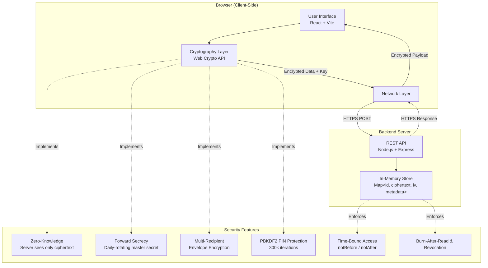

# Secured_Gossip

## Overview
Secured_Gossip is an original, anonymous, client-side encrypted, ephemeral secret-sharing platform built for secure sharing of sensitive text, API keys, and credentials. All encryption/decryption happens in the browser using the Web Crypto API, ensuring the server never sees plaintext or encryption keys.

## Problem Understanding & Core Functionality
The platform addresses the need for secure secret sharing without exposing data to servers or third parties. Core functionality includes:
- Client-side AES-256-GCM encryption via Web Crypto API
- Zero-knowledge architecture (server stores only ciphertext)
- Burn-after-read (one-time secrets)
- Configurable TTL expiration (5 min, 1h, 1d)
- PIN protection with PBKDF2 (300k iterations)
- Creator delete/revoke token
- Creator status tracking (waiting/seen/expired/revoked/destroyed)
- Multi-recipient envelope encryption
- Forward secrecy via daily-rotating master secret
- Time-bound access windows (notBefore/notAfter)
- IP-based rate limiting (30 reveals/min/IP)

## Innovation & Meaningful Differentiation
Beyond basic zero-knowledge sharing, Secured_Gossip introduces:
- **Forward Secrecy**: Daily-rotating master secret with HKDF-derived per-paste keys; compromise of one paste does not affect others.
- **Multi-Recipient Envelope Encryption**: Single encryption operation with key wrapped per recipient using passphrase-derived KEK.
- **Time-Bound Access**: notBefore/notAfter timestamps in addition to TTL for precise availability control.
- **Creator-Controlled Revocation**: UUID-based delete token for instant revocation before reading.
- **PIN Attempt Limiting**: 5 incorrect PIN attempts trigger self-destruct to mitigate brute force.
- **Status Tracking**: Creator dashboard showing secret state (waiting/seen/expired/revoked/destroyed).

## Technical Implementation & Architecture
## Technical Implementation & Architecture

### Architecture


### Component Breakdown
| Layer | Technology | Responsibility |
|-------|------------|----------------|
| Frontend | React 18 + Vite | UI, key generation, encryption/decryption, URL fragment handling |
| Crypto Layer | Web Crypto API (SubtleCrypto) | AES-256-GCM, HKDF, PBKDF2, envelope encryption |
| Backend | Node.js + Express | REST API, rate limiting, PIN verification, ephemeral storage |
| Storage | In-Memory Map | Ciphertext + IV + metadata only (plaintext/key never stored) |
| Security | Client-Side Only | All cryptographic operations happen in browser |

## User Experience & Accessibility
- Minimal, focused UI for cryptographic operations
- Clear feedback for create, view, and revoke actions
- Works in modern browsers (Chrome, Firefox, Safari, Edge) without extensions
- No required browser extensions or plugins
- Accessible design with sufficient color contrast and keyboard navigation

## Performance & Reliability / Demo Quality
- Low latency: encryption/decryption performed in-browser
- Rate limiting prevents abuse (30 reveal attempts/minute/IP)
- Self-destruct mechanism after 5 failed PIN attempts
- Ephemeral storage ensures no persistent data retention
- Straightforward local setup for demonstration and testing

## How to Run Locally

### Requirements
- Node.js v18+
- Modern browser (Chrome, Firefox, Safari, Edge)

### Backend Setup
1. Clone the repository:
   ```
   git clone https://github.com/yourusername/Secured_Gossip.git
   cd Secured_Gossip
   ```
2. Install dependencies and start server:
   ```
   cd backend
   npm install
   node src/server.js
   ```
   Server runs at http://localhost:3001

### Frontend Setup
1. In a new terminal:
   ```
   cd ../frontend
   npm install
   ```
2. Start development server:
   ```
   npm run dev
   ```
   App available at http://localhost:5173

### Testing
1. Open http://localhost:5173 in your browser
2. Enter a secret (e.g., API key, password)
3. Configure options:
   - Expiry: 5 min, 1h, or 1d
   - Burn-after-read: Enable for one-time viewing
   - PIN: Add 4-32 character PIN
   - Multi-recipient: Share with multiple people using separate passphrases
   - Schedule: Set notBefore and notAfter timestamps
4. Click Create Secret
5. Copy the generated link (contains ID in path, version query param, key in fragment)
6. Open link in new incognito/private window to verify decryption
7. Test burn-after-read by reloading link (should show "not found")
8. Test PIN protection with wrong/right PINs
9. Test revocation using the delete token shown after creation


## Acknowledgments
- PrivateBin and ZeroBin for pioneering zero-knowledge pastebin concept
- Web Crypto API team for enabling client-side cryptography in browsers
- Open source cryptography community for standards (AES-GCM, HKDF, PBKDF2)
- Hackathon organizers for the challenge that inspired this project
